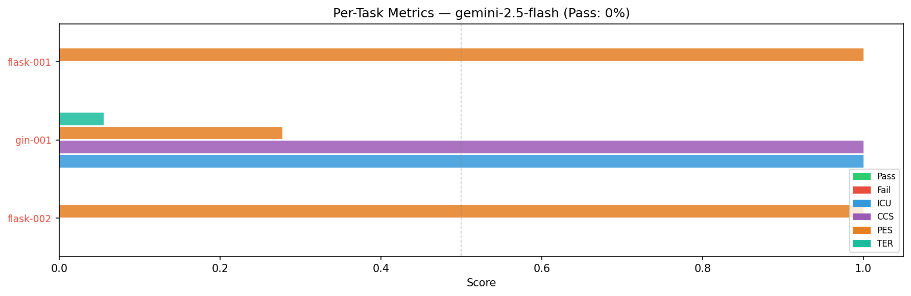
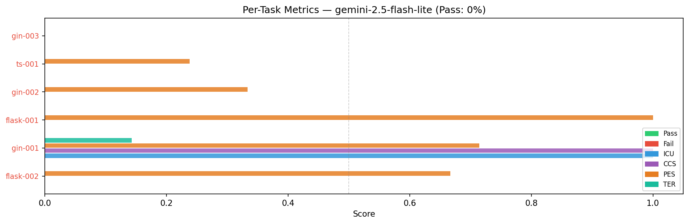
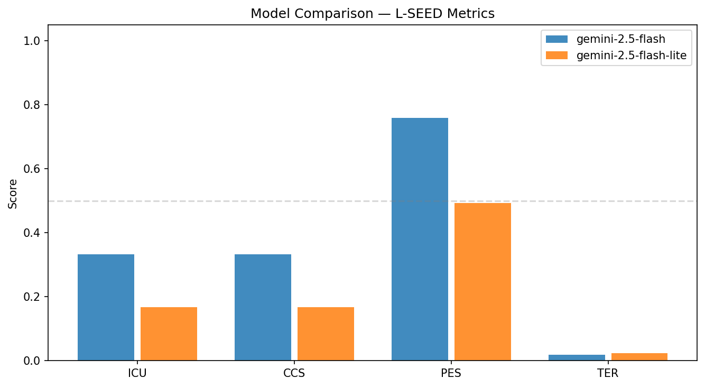
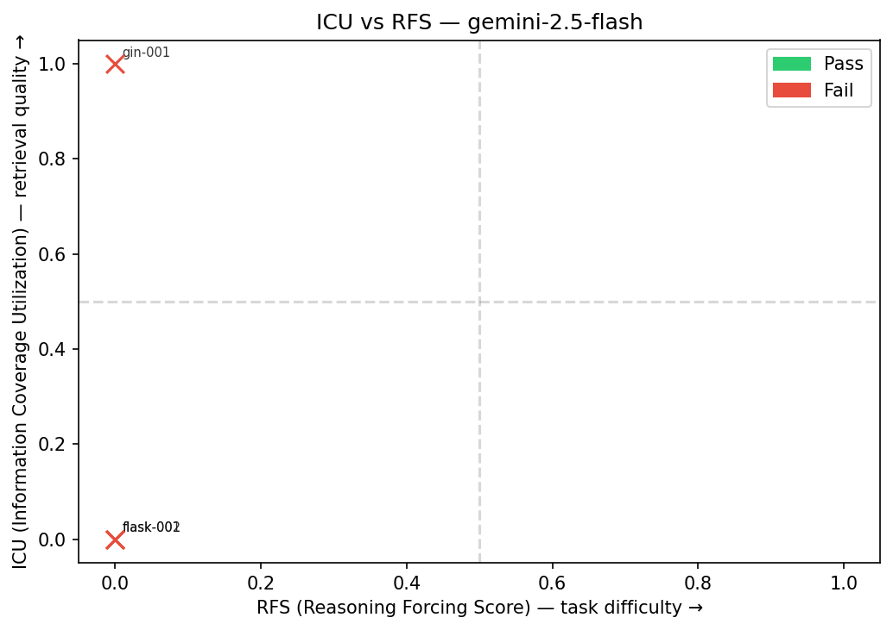
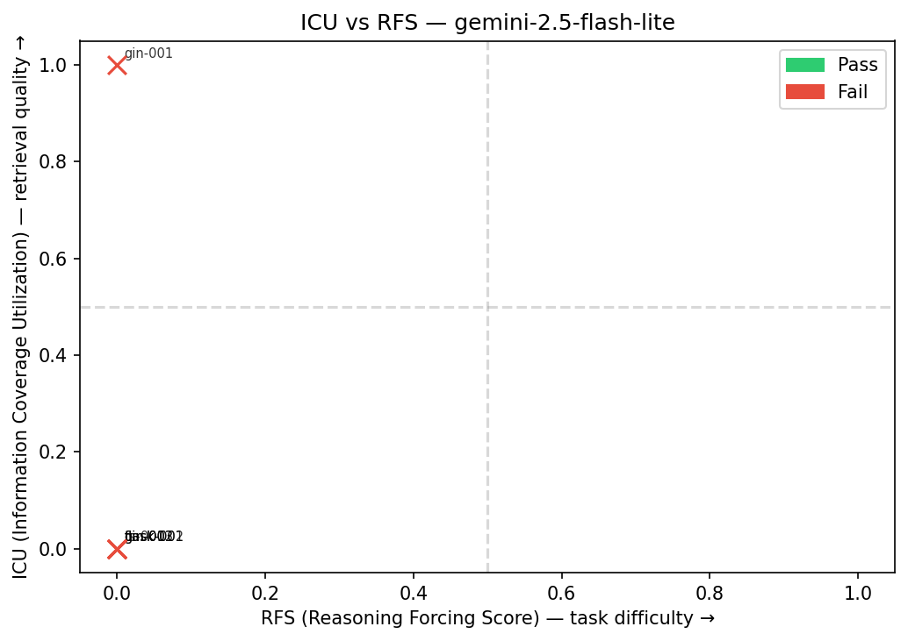
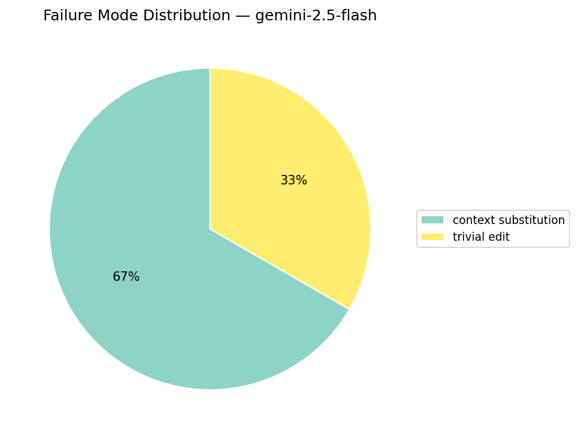
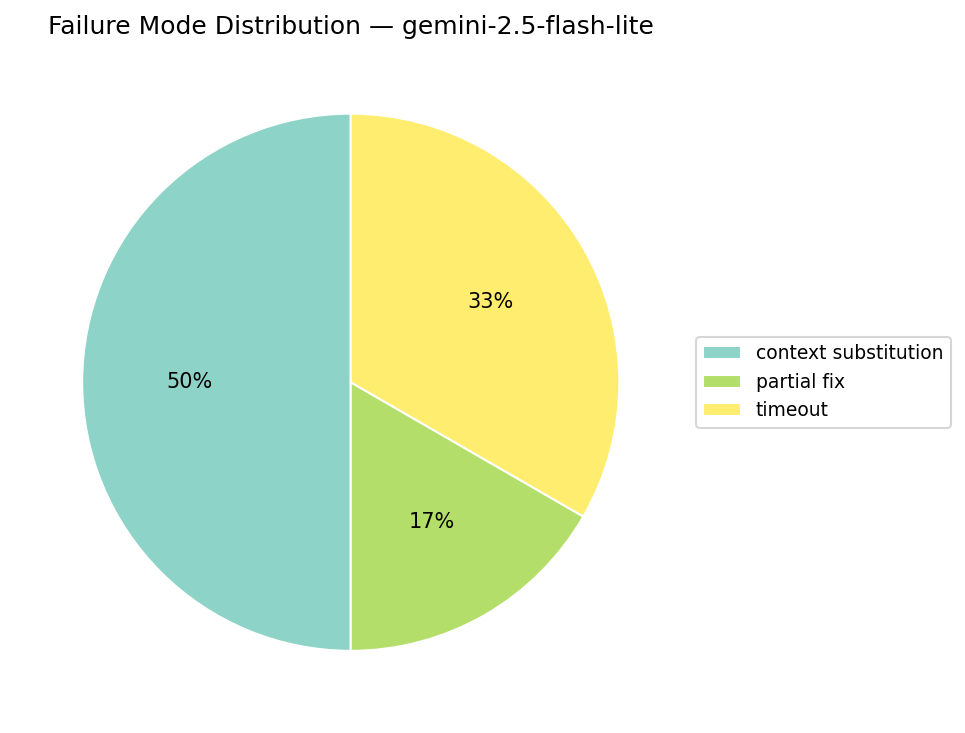

# L-SEED Documentation

This repo is a prototype that defines a long context coding benchmark pipeline for Gemini CLI evaluation.

## Program Context

As current agent evaluation benchmarks such as SWE-bench Pro and TerminalBench saturate, they are becoming less effective for measuring enterprise-level capability. Many tasks are comparatively narrow in code scope and reasoning depth.

This project targets a harder benchmark: a curated long context dataset built from large, active, multi-language repositories, with tasks that require multi-step reasoning across wide code context.

## Core Objective

Build a benchmark that verifies whether an agent can:

- navigate very large codebases
- identify architectural constraints across distant files
- implement correct multi-file changes
- maintain quality under deep context pressure

## Expected Outcomes

1. Repository Curation: onboard 30-50 large-scale active repositories across modern languages and frameworks.
2. Task Formulation: define difficult multi-file tasks that strictly require long context comprehension.
3. Schema Design: provide a standardized dataset schema for reproducible automated evaluation.
4. Pipeline Integration: integrate this dataset into Gemini CLI eval and testing workflows.
5. Baseline Analysis: publish baseline success rates and failure mode analysis for long context reasoning.

## Current Progress Snapshot

| Item | Value |
|---|---:|
| Repositories onboarded (pinned) | 3 |
| Raw mined candidates | 190 |
| Handcrafted validated tasks | 9 |

| Model | Tasks Run | Pass Rate | Avg ICU | Avg CCS | Avg PES | Avg TER |
|---|---:|---:|---:|---:|---:|---:|
| `gemini-2.5-flash` | 3 | 0.000 | 0.333 | 0.333 | 0.759 | 0.018 |
| `gemini-2.5-flash-lite` | 6 | 0.000 | 0.167 | 0.167 | 0.492 | 0.024 |
| `gemini-2.5-pro` | - | - | - | - | - | - |
| `gemini-3-flash-preview` | - | - | - | - | - | - |
| `gemini-3.1-pro-preview` | - | - | - | - | - | - |

Generated analysis artifacts:

- `data/results/gemini-2.5-flash/2026-03-31_analysis.json`
- `data/results/gemini-2.5-flash-lite/2026-03-31_analysis.json`
- `data/results/comparison/model_comparison.json`
- `data/results/figures/model_comparison.png`
- `data/results/figures/per_task_metrics_gemini-2.5-flash.png`
- `data/results/figures/per_task_metrics_gemini-2.5-flash-lite.png`
- `data/results/figures/model_comparison.png`
- `data/results/figures/icu_vs_rfs_gemini-2.5-flash.png`
- `data/results/figures/icu_vs_rfs_gemini-2.5-flash-lite.png`
- `data/results/figures/failure_dist_gemini-2.5-flash.png`
- `data/results/figures/failure_dist_gemini-2.5-flash-lite.png`

## Figures









## Documentation Map

| Document | Purpose |
|---|---|
| `docs/QUICKSTART.md` | Environment setup and first commands |
| `docs/ARCHITECTURE.md` | System architecture and component responsibilities |
| `docs/CDM.md` | CDM algorithm, signals, and scoring formulas |
| `docs/EXTRACTION_PIPELINE.md` | Candidate mining, tagging, and validation flow |
| `docs/TASK_SCHEMA.md` | JSON schemas and field-level guidance |
| `docs/CODEGEN_AND_EVAL.md` | Eval TypeScript generation and harness assertions |
| `docs/ANALYSIS_AND_REPORTING.md` | Metrics, aggregation, reports, and figures |
| `docs/OPERATIONS.md` | End-to-end runbook and troubleshooting |
| `docs/REPO_STRUCTURE.md` | Repository directory map |

## Repository Structure

```text
l-seed/
├── requirements.txt                          # Python dependencies
├── analysis/                                 # Evaluation metrics, aggregation, reporting, plotting
│   ├── aggregator.py                         # Builds analysis JSON from JSONL run logs
│   ├── failure-taxonomy.py                   # Failure mode definitions and classification helpers
│   ├── metrics.py                            # Metric computations (ICU, CCS, PES, TER, etc.)
│   ├── reporter.py                           # Generates markdown reports
│   └── visualizer.py                         # Generates charts and figures
├── cdm/                                      # Context Dependency Mapper core
│   ├── __init__.py                           # Package marker
│   ├── mapper.py                             # Multi-signal dependency analysis and complexity scoring
│   ├── languages/
│   │   ├── go_parser.py                      # Go import and symbol parser
│   │   ├── python_parser.py                  # Python import and symbol parser
│   │   └── typescript_parser.py              # TypeScript import and symbol parser
│   └── tests/
│       └── test_mapper.py                    # CDM tests
├── codegen/                                  # Task JSON -> Gemini eval TypeScript files
│   ├── eval_generator.py                     # Loads task records and renders eval files
│   ├── run_codegen.py                        # CLI wrapper for generation
│   └── templates/
│       └── eval_template.ts.jinja2           # Eval template
├── config/
│   └── repo_manifest.json                    # Pinned repository manifest
├── data/                                     # Dataset artifacts
│   ├── repos/
│   │   ├── flask/                            # Pinned source repo snapshot
│   │   ├── gin/                              # Pinned source repo snapshot
│   │   └── typescript/                       # Pinned source repo snapshot
│   ├── results/                              # Run outputs (logs, analysis, reports, figures)
│   └── tasks/
│       ├── raw/                              # Mined candidate tasks
│       └── validated/                        # Curated tasks ready for eval
├── docs/                                     # Project and system design docs
│   ├── ARCHITECTURE.md
│   ├── ANALYSIS_AND_REPORTING.md
│   ├── CDM.md
│   ├── CODEGEN_AND_EVAL.md
│   ├── EXTRACTION_PIPELINE.md
│   ├── OPERATIONS.md
│   ├── QUICKSTART.md
│   ├── REPO_STRUCTURE.md
│   └── TASK_SCHEMA.md
└── extraction/                               # Mining, scoring, validation, review
    ├── git_miner.py                          # Main CDM-based miner
    ├── repo_scorer.py                        # Repository candidacy scoring
    ├── task_validator.py                     # Task schema and coherence validation
    ├── ts_miner.py                           # TypeScript-specific mining strategy
    ├── viewer.py                             # Interactive candidate review and tagging
    └── data/
        └── tasks/                            # Local extraction-side task artifact folder
```

## High Level Flow

```mermaid
flowchart LR
    A[Repository Curation 30-50 repos] --> B[Long Context Task Mining]
    B --> C[Raw candidates in data/tasks/raw]
    C --> D[Human review and validation]
    D --> E[Validated tasks in data/tasks/validated]
    E --> F[Codegen into eval .ts files]
    F --> G[Gemini CLI runs produce JSONL logs]
    G --> H[Aggregation and metrics]
    H --> I[Baseline reports and failure analysis]
```



## Typical End-to-End Commands

```bash
# 1) Mine candidates
python3 extraction/git_miner.py

# 2) Review candidates interactively
python3 extraction/viewer.py --repo flask

# 3) Validate finalized task JSON files
python3 extraction/task_validator.py data/tasks/validated/*.json --strict

# 4) Generate eval files
python3 codegen/run_codegen.py --tasks flask-001

# 5) Aggregate run logs
python3 analysis/aggregator.py \
  --input data/results/<model>/<date>_run.jsonl \
  --tasks data/tasks/validated \
  --model <model-name> \
  --output data/results/<model>/<date>_analysis.json
```

## Notes

- Current repository content is a seed set and pipeline implementation that scales toward the 30-50 repository target.
- `data/repos/*` are pinned snapshots and are expected to be large.
- Some generated artifacts in `data/tasks/raw` can lag behind the latest mapper fields.
- Prefer `python3` when running scripts in this repository.
