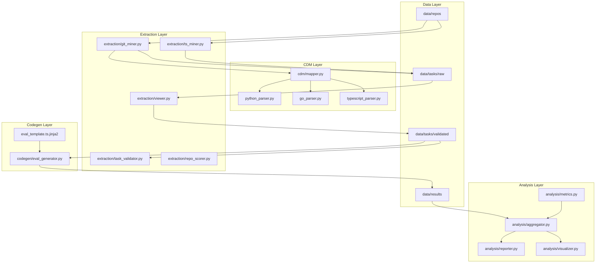
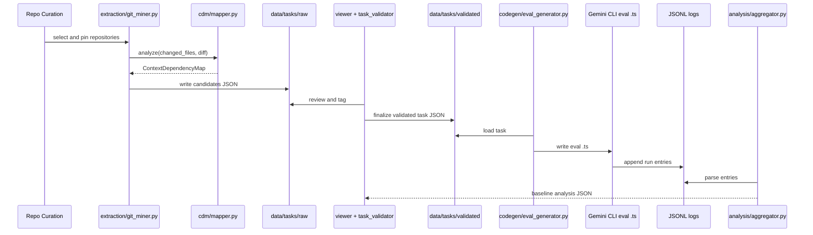

# Architecture

## System Layers

L-SEED is organized into five layers for a large scale dataset program:

1. Repository curation and pinned snapshots
2. CDM reasoning and dependency analysis
3. Task extraction and curation pipeline
4. Gemini CLI eval generation and integration
5. Baseline analytics and failure mode reporting

## Component Graph

## Package Responsibilities

| Directory | Responsibility |
|---|---|
| `cdm/` | Build import graphs, compute required context, and derive complexity metrics |
| `extraction/` | Discover commit candidates and curate them into task artifacts |
| `codegen/` | Convert validated task JSON into executable eval `.ts` files |
| `analysis/` | Compute benchmark metrics from JSONL logs and generate outputs |
| `data/` | Store repos, raw candidates, validated tasks, and results |
| `config/` | Track pinned repo metadata and language mapping |

## Runtime Data Contracts

### Contract A: Candidate Record

- Produced by `extraction/git_miner.py` and `extraction/ts_miner.py`
- Stored under `data/tasks/raw/*_candidates.json`
- Must include top level commit metadata plus nested `cdm` block

### Contract B: Validated Task Record

- Stored under `data/tasks/validated/*.json`
- Includes prompt, constraint assertions, and runtime metadata used by codegen

### Contract C: Eval Run Log Entry

- JSONL entries produced by generated eval tests
- Consumed by `analysis/aggregator.py` and `analysis/metrics.py`

### Contract D: Analysis JSON

- Structured summary produced by aggregator
- Consumed by reporter and visualizer

## Execution Sequence

## Design Notes

- Architecture is designed to scale from a small seed corpus to 30-50 repositories.
- CDM is language aware through parser adapters, while scoring logic stays centralized in `cdm/mapper.py`.
- TypeScript has a second miner (`extraction/ts_miner.py`) because compiler namespace exports can flatten import graph quality.
- Analysis keeps task level properties separate from run level behavior to avoid metric leakage.
