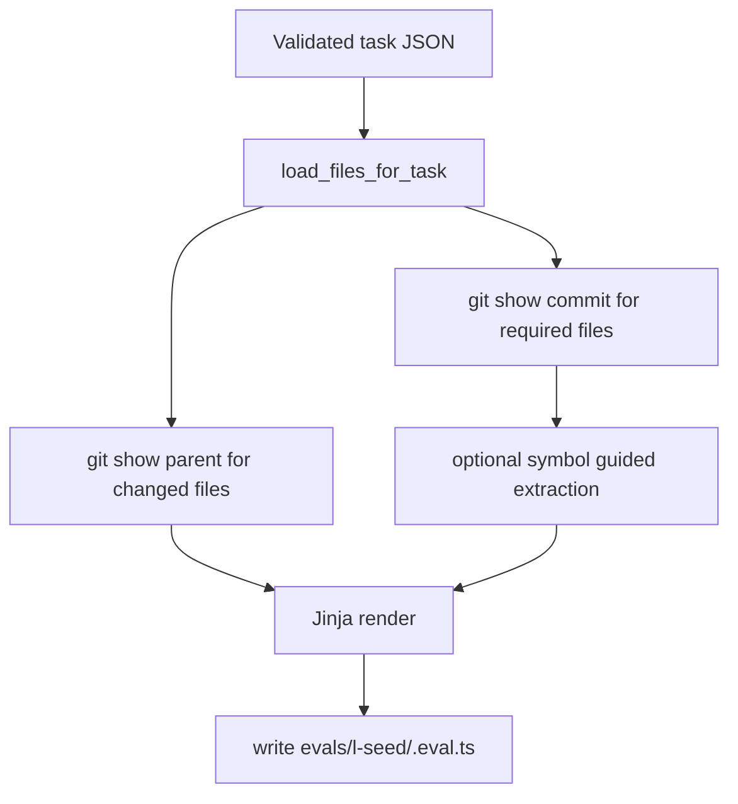

# Codegen and Eval Harness

This document covers how validated tasks are converted to executable eval TypeScript files.

## Core Files

| File | Role |
|---|---|
| `codegen/eval_generator.py` | Loads task JSON, fetches git snapshots, renders template |
| `codegen/run_codegen.py` | CLI wrapper for single or batch generation |
| `codegen/templates/eval_template.ts.jinja2` | Eval harness template with assertions and logging |

## Generation Flow



## File Loading Semantics

`eval_generator.py` uses two refs:

- changed files from `commit_sha^` (pre fix baseline)
- required context files from `commit_sha` (context at target commit)

This keeps baseline and context behavior aligned with task intent.

## Truncation Strategy

Config constants:

| Constant | Default | Meaning |
|---|---|---|
| `MAX_REQUIRED_CHARS` | `80000` | Max chars for each required context file |
| `MAX_CHANGED_CHARS` | `20000` | Max chars for each changed baseline file |
| `CONTEXT_LINES` | `60` | Symbol guided extraction window size |

Rules:

- required files are kept in full if within limit
- oversized required files are reduced with symbol guided section extraction
- changed files are capped with simple truncation

## Jinja Template Gates

The eval template uses a staged assertion strategy:

1. all required context files were read successfully
2. at least one expected changed file differs from baseline
3. all expected changed files are modified
4. no trivial modifications (minimum meaningful delta)
5. soft constraint symbol checks over written content

It also logs structured JSONL entries for later aggregation.

## CLI Usage

Generate all tasks:

```bash
python3 codegen/run_codegen.py --gemini-cli ../gemini-cli
```

Generate specific tasks:

```bash
python3 codegen/run_codegen.py --tasks flask-001 gin-001 --gemini-cli ../gemini-cli
```

Dry run:

```bash
python3 codegen/run_codegen.py --dry-run
```

## Output Location

By default generated files go to:

```text
../gemini-cli/evals/l-seed/<task_id>.eval.ts
```

## Type Check and Run

```bash
cd ../gemini-cli
npx tsc --noEmit evals/l-seed/*.eval.ts
```

Single eval run example:

```bash
cd ../gemini-cli
RUN_EVALS=1 GEMINI_MODEL=gemini-2.5-flash \
L_SEED_LOG=../<l-seed-repo>/data/results/run1.jsonl \
npx vitest run evals/l-seed/flask-001.eval.ts
```

## Practical Notes

- The template expects tool args in JSON string form from harness logs.
- `read_many_files` is interpreted as glob based retrieval.
- baseline hashes are embedded to detect true modifications instead of incidental writes.
- This stage is the primary bridge for integrating the curated dataset into the Gemini CLI evaluation pipeline.
