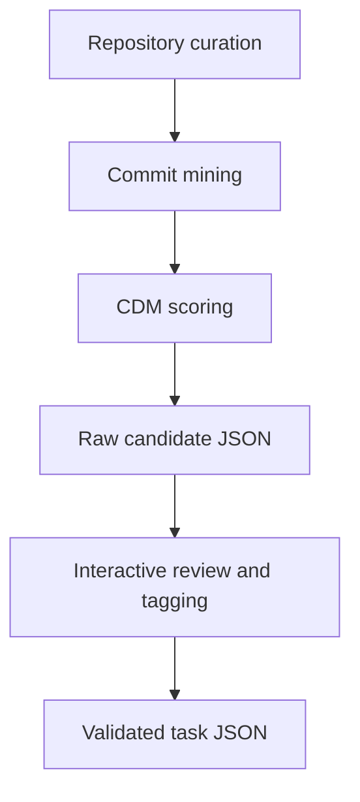

# Extraction Pipeline

This pipeline finds promising commits and converts them into curated long context benchmark tasks for Gemini CLI evaluations.

Program target:

- 30-50 very large active repositories
- broad language and framework coverage
- tasks that require deep cross file reasoning across large context windows

## Pipeline Stages



## Stage 0: Repository Screening

Script: `extraction/repo_scorer.py`

Purpose:

- Estimate if a repository is worth mining before expensive runs
- Prioritize repositories likely to yield deep architectural tasks
- Support scale out planning toward the 30-50 repository target

Signals:

- import density
- interface count
- test coverage estimate
- qualifying commit count
- commit message quality
- contamination risk estimate

Curation guidance for this program:

- favor high activity and large code surface
- favor multi package or multi module architecture
- include diverse ecosystems (backend, frontend, infra, data)
- include repos where cross component bug fixes are common

Example:

```bash
python3 extraction/repo_scorer.py --all
python3 extraction/repo_scorer.py --repo data/repos/gin --language go
```

## Stage 1: General Mining

Script: `extraction/git_miner.py`

For each configured repo:

1. read latest `n_commits`
2. keep commits with enough non test source files changed
3. build diff and call CDM
4. remove test files from required context
5. keep commits passing irreducibility threshold

Task types to prioritize during curation:

- deep architectural bug fixes
- cross component feature integration
- behavior changes requiring synchronized edits
- dependency boundary updates that span multiple modules

Output files:

- `data/tasks/raw/<repo>_candidates.json`
- `data/tasks/raw/all_candidates.json`

Example:

```bash
python3 extraction/git_miner.py
DEBUG_MINING=1 python3 extraction/git_miner.py
```

## Stage 2: TypeScript Specific Mining

Script: `extraction/ts_miner.py`

Why separate:

- TypeScript compiler heavily uses namespace barrels
- import graph often becomes low signal for context discovery

Approach:

1. build symbol to definition file map under `src/compiler`
2. extract uppercase identifiers from diff lines
3. map symbols to external definition files
4. score by ratio of external symbol definitions

Output:

- `data/tasks/raw/typescript_candidates.json`

Example:

```bash
python3 extraction/ts_miner.py
```

## Stage 3: Interactive Review

Script: `extraction/viewer.py`

Features:

- prints commit, diff preview, CDM details
- supports tagging each candidate as `keep`, `skip`, or `maybe`

Tag output:

- `data/tasks/raw/tagged_candidates.json`

Examples:

```bash
python3 extraction/viewer.py --repo flask
python3 extraction/viewer.py --limit 5
python3 extraction/viewer.py --tagged
```

## Stage 4: Task Validation

Script: `extraction/task_validator.py`

Validation checks:

1. schema fields and allowed values
2. git coherence for changed and required files at commit refs
3. semantic warnings around irreducibility and propagation targets
4. manual contamination check reminder

Examples:

```bash
python3 extraction/task_validator.py data/tasks/validated/flask-001.json
python3 extraction/task_validator.py data/tasks/validated/*.json --strict
```

## Miner Configuration Reference

`extraction/git_miner.py` has `REPO_CONFIGS` entries with fields:

| Field | Meaning |
|---|---|
| `id` | Repository id used in paths |
| `path` | Local repository root |
| `language` | Parser language |
| `subtree` | Optional subtree for graph and file filtering |
| `min_files` | Minimum changed source files per commit |
| `n_commits` | Lookback commit count |
| `min_irr` | Irreducibility acceptance threshold |
| `debug` | Repo specific debug logging |

## Raw Candidate Contract

Each candidate currently contains:

| Key | Type |
|---|---|
| `repo_id` | string |
| `language` | string |
| `sha` | string |
| `message` | string |
| `changed_files` | list[string] |
| `cdm` | object |
| `diff_preview` | string |

`cdm` typically includes:

- `required_context_files`
- `context_distance_hops`
- `irreducibility_score`
- `rfs`
- `required_context_details`

Some older raw files may not yet include `cfrd`.

## Operational Tips

- Keep TypeScript mining separate when compiler topology is noisy.
- Use `DEBUG_MINING=1` when tuning thresholds.
- Review rejected examples in debug output before lowering thresholds globally.
